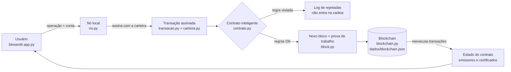

# CertChain UEA — Certificados acadêmicos em Blockchain

Trabalho do 1º bimestre — **Oficina de Desenvolvimento de Sistemas III** (UEA).

Aplicação que registra diplomas e certificados em uma **blockchain local**, com um **contrato inteligente** que define quem pode emitir, revogar e como qualquer pessoa verifica a autenticidade de um documento.

---

## 1. Problema

Diplomas falsos e adulterados são um problema recorrente: um PDF pode ser editado (curso, carga horária, nome) e a verificação hoje depende de contato manual com a secretaria da instituição, que é lento, só funciona em horário comercial e depende de um sistema central que pode ser alterado ou ficar indisponível.

## 2. Solução

- A **secretaria acadêmica** (emissor autorizado) registra na blockchain o **hash SHA-256 do PDF** do diploma.
- **Qualquer pessoa** (empresa, outra universidade) verifica o diploma arrastando o PDF: se o hash bater com um registro ativo, o documento é autêntico; se **1 byte** tiver sido alterado, o hash muda e o documento não é reconhecido.
- A **Reitoria** (administrador) controla quais setores podem emitir.
- Um certificado emitido por engano pode ser **revogado** — mas o registro original e a revogação ficam no histórico para sempre.

## 3. Por que Blockchain?

| Necessidade | Como a blockchain atende |
|---|---|
| Registro não pode ser alterado depois de emitido | Cada bloco contém o hash do anterior; alterar um bloco quebra toda a cadeia seguinte (detectado na validação) |
| Saber **quem** emitiu cada certificado | Toda transação é **assinada digitalmente** (Ed25519) pelo emissor |
| Regras aplicadas sempre da mesma forma | As regras estão no **contrato inteligente**, executado antes de qualquer registro |
| Auditoria completa | Emissões, revogações e mudanças de permissão ficam no histórico, em ordem |
| Verificação pública sem expor dados pessoais | Só hashes vão para a cadeia (LGPD) |

Um banco de dados comum permitiria que um administrador alterasse ou apagasse um registro sem deixar rastro; aqui qualquer alteração é detectável.

## 4. Arquitetura



| Arquivo | Papel |
|---|---|
| `block.py` | Bloco: índice, timestamp, hash anterior, dados, nonce, hash SHA-256 e prova de trabalho (baseado no exemplo do professor) |
| `blockchain.py` | Cadeia: gênesis, mineração, validação (elo, hash, prova de trabalho) e persistência em JSON |
| `carteira.py` | Identidades: par de chaves Ed25519; endereço `0x…` derivado da chave pública |
| `transacao.py` | Transação assinada: tipo, remetente, chave pública, nonce, timestamp, payload, assinatura |
| `contrato.py` | **Contrato inteligente** com as regras de negócio |
| `no.py` | Nó local: passa a transação pelo contrato, minera, salva, registra rejeições, reconstrói o estado ao iniciar |
| `app.py` | Interface Streamlit |
| `tests/` | Testes automatizados (pytest) |

**Estado derivado da cadeia:** o estado do contrato (emissores e certificados) não é salvo à parte — ao iniciar, o nó reexecuta todas as transações desde o bloco gênesis. A blockchain é a única fonte da verdade.

## 5. Contrato inteligente

Papéis:
- **Administrador** (Reitoria) — definido no bloco gênesis; autoriza e remove emissores.
- **Emissor** (secretarias acadêmicas) — emite e revoga certificados.
- **Público** — verifica certificados (consulta, sem transação).

Toda transação é validada **por inteiro antes** de alterar o estado; se qualquer regra falhar, ela é rejeitada e **nenhum bloco é criado**.

| Regra | Operação | Descrição |
|---|---|---|
| G1 | todas | transação com todos os campos obrigatórios |
| G2 | todas | operação conhecida |
| G3 | todas | remetente corresponde à chave pública |
| G4 | todas | assinatura digital válida (transação não foi alterada) |
| G5 | todas | nonce sequencial por conta (impede *replay*) |
| A1–A5 | AUTORIZAR_EMISSOR | só admin; endereço válido; nome 3–100 caracteres; admin não pode ser emissor; emissor não pode já estar ativo |
| R1–R2 | REMOVER_EMISSOR | só admin; emissor precisa estar ativo |
| E1 | EMITIR_CERTIFICADO | remetente precisa ser emissor ativo |
| E2–E3 | EMITIR_CERTIFICADO | código no formato `A-Z0-9-` (4–40) e único |
| E4–E5 | EMITIR_CERTIFICADO | hash do documento SHA-256 válido e não registrado antes |
| E6 | EMITIR_CERTIFICADO | hash do titular SHA-256 válido |
| E7–E9 | EMITIR_CERTIFICADO | curso 3–120 caracteres; carga horária 1–20000; data de conclusão válida e não futura |
| V1–V4 | REVOGAR_CERTIFICADO | certificado existe; está ativo; só o emissor original ou o admin; motivo 5–200 caracteres |
| N1 | nó | o nó recusa novas transações se a cadeia estiver corrompida |

## 6. Quais dados ficam na Blockchain

| Na blockchain (público e imutável) | Fora da blockchain |
|---|---|
| Hash SHA-256 do PDF do diploma | O PDF em si (fica com o aluno / instituição) |
| Hash do titular (`matrícula + nome normalizado`) | Nome, matrícula, CPF do aluno |
| Código do certificado, curso, carga horária, data de conclusão | Histórico escolar, notas |
| Instituição emissora e endereço do emissor | Chaves privadas das carteiras |
| Status (ATIVO / REVOGADO), motivo e bloco da revogação | Log de transações rejeitadas (só no nó) |
| Assinatura digital, nonce e timestamp de cada transação | |

Com isso a verificação é pública sem expor dados pessoais (LGPD): quem tem o PDF e/ou o nome + matrícula consegue conferir; quem só olha a cadeia vê apenas hashes.

> Nesta versão de demonstração as chaves privadas das 4 contas ficam em `dados/carteiras.json` (como as contas pré-criadas do Ganache/Hardhat). Em produção cada instituição guardaria sua própria chave.

## 7. Como executar

Requisitos: Python 3.10+.

```bash
pip install -r requirements.txt
streamlit run app.py          # interface em http://localhost:8501
python -m pytest -v           # testes
python main.py                # demo do núcleo no terminal (como o exemplo do professor)
```

No Windows também é possível dar dois cliques em `executar.bat` (interface) ou `testes.bat`.

Na primeira execução é criada a pasta `dados/` com a blockchain (`blockchain.json`), as carteiras e o log de rejeições. **Para zerar a blockchain, apague a pasta `dados/`.**

Diplomas de exemplo para a demonstração estão em `exemplos/` (inclui uma versão adulterada).

## 8. Testes e resultados

**49 testes automatizados, todos passando** (`python -m pytest -v`):

| Grupo | Qtd | Cobertura |
|---|---|---|
| Integridade da blockchain | 7 | encadeamento, prova de trabalho, adulteração de dados, atacante que "remina" um bloco, bloco sem PoW, salvar/carregar |
| Operações válidas | 9 | autorizar emissor, emitir (estado muda), verificar pelo PDF, conferir titular, revogar (emissor e admin), remover emissor |
| Sem permissão | 6 | aluno autorizando/emitindo, emissor não autorizado ou removido, outro emissor revogando, emissor removendo emissor |
| Entradas inválidas | 20 | código, hashes, curso, carga horária e data inválidos; duplicidade de código e documento; revogar inexistente, duas vezes ou sem motivo; operação desconhecida; rejeição não cria bloco |
| Segurança | 5 | transação alterada após assinatura, falsificação de remetente, *replay*, transação mal formada, nó com cadeia adulterada |
| Persistência | 2 | reinício reconstrói o estado; arquivo adulterado detectado ao iniciar |

## 9. Roteiro da demonstração

1. `streamlit run app.py` — mostrar o bloco gênesis na aba **Blockchain** (cadeia íntegra).
2. Conta **Reitoria** → aba **Emissores** → autorizar a *Secretaria Acadêmica EST* → bloco #1 minerado.
3. Conta **Secretaria EST** → aba **Emitir** → `exemplos/diploma_ana_souza.pdf` → bloco #2 (confirmação com hash e nonce).
4. Aba **Verificar** → arrastar o PDF original (✅ autêntico) e o `_ADULTERADO` (❌ não encontrado).
5. Conta **Carlos (aluno)** → tentar emitir → ❌ rejeitado (regra E1); ver na aba **Rejeitadas**.
6. Conta **Secretaria EST** → **Revogar** → verificar de novo pelo código (🚫 revogado — alteração de estado).
7. Aba **Blockchain** → *simular adulteração* → cadeia inválida no bloco #2 → **Restaurar do disco**.

## Referências

- Exemplo de blockchain em Java e aplicação em Python disponibilizados pelo professor (base de `block.py` e `blockchain.py`).
- Anders Brownworth — *Blockchain Demo*.
