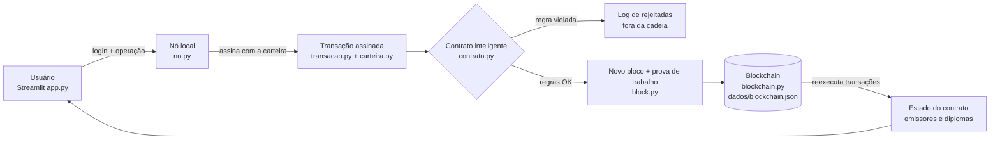

# CertChain UEA: diplomas acadêmicos em blockchain

Trabalho do 1º bimestre da disciplina Oficina de Desenvolvimento de Sistemas III (UEA).

O CertChain registra diplomas em uma blockchain local. Um contrato inteligente decide quem pode emitir e revogar, e qualquer pessoa consegue conferir se um diploma é autêntico.

## 1. Problema

Um diploma em PDF é fácil de editar: dá para trocar o curso, a carga horária ou o nome em poucos minutos. Para conferir, a empresa precisa falar com a secretaria da universidade, o que demora e só funciona em horário comercial. E o sistema da secretaria é um banco de dados central, onde quem tem acesso de administrador consegue alterar ou apagar um registro sem que ninguém perceba.

## 2. Solução

A secretaria acadêmica preenche os dados do aluno e o sistema gera o PDF do diploma. O hash SHA-256 desse PDF vai para a blockchain dentro de uma transação assinada pela secretaria.

Quem recebe o diploma (uma empresa, outra universidade) arrasta o PDF na tela de verificação. Se o hash bater com um registro ativo, o diploma é autêntico. Se alguém mudou um único byte do arquivo, o hash muda e o sistema não reconhece o documento.

A Reitoria, como administradora, define quais setores podem emitir. Um diploma emitido por engano pode ser revogado, e tanto a emissão quanto a revogação continuam no histórico.

## 3. Por que usar blockchain

| O que precisamos | Como a blockchain resolve |
|---|---|
| Registro que não muda depois de emitido | Cada bloco guarda o hash do anterior. Se alguém altera um bloco, a validação acusa a quebra da cadeia |
| Saber quem emitiu cada diploma | Cada transação leva a assinatura digital (Ed25519) de quem a enviou |
| Regras iguais para todos | O contrato inteligente confere as regras antes de qualquer registro |
| Histórico para auditoria | Emissões, revogações e mudanças de permissão ficam na cadeia, em ordem |
| Verificação pública sem expor dados pessoais | Na cadeia só entram hashes (LGPD) |

Num banco de dados comum, o administrador pode editar um registro sem deixar rastro. Aqui, uma alteração dessas faz a validação da cadeia falhar.

## 4. Arquitetura



| Arquivo | O que faz |
|---|---|
| `block.py` | Bloco com índice, timestamp, hash anterior, dados, nonce, hash SHA-256 e prova de trabalho. Partimos do exemplo do professor |
| `blockchain.py` | Cadeia: bloco gênesis, mineração, validação (elo, hash e prova de trabalho) e gravação em JSON |
| `carteira.py` | Identidade de cada conta: um par de chaves Ed25519. A chave privada fica cifrada com a senha, e fazer login é decifrá-la. O endereço `0x...` vem da chave pública |
| `transacao.py` | Transação assinada: tipo, remetente, chave pública, nonce, timestamp, payload e assinatura |
| `contrato.py` | Contrato inteligente com as regras de negócio |
| `no.py` | Nó local. Cuida do login e do cadastro, passa a transação pelo contrato, minera, salva e registra as rejeições. Ao iniciar, reconstrói o estado a partir da cadeia |
| `diploma.py` | Gera o PDF do diploma a partir dos dados do formulário |
| `app.py` | Interface Streamlit: login, emissão, verificação (também sem login), revogação, emissores, explorador da blockchain e rejeitadas |
| `tests/` | Testes com pytest para operações válidas, entradas inválidas, falta de permissão, segurança e integridade da cadeia |

O estado do contrato (emissores e diplomas) não fica salvo em outro lugar. Toda vez que o nó inicia, ele reexecuta as transações desde o bloco gênesis, então a blockchain é a única fonte de dados.

## 5. Contrato inteligente

Papéis:

- Administrador (Reitoria): definido no bloco gênesis. Autoriza e remove emissores, e não emite diplomas.
- Emissor (secretarias acadêmicas): emite diplomas e revoga os que emitiu. As secretarias EST e ESA aparecem no bloco gênesis (`emissores_iniciais`), então essa permissão também está na blockchain.
- Sem permissão (Carlos e alunos cadastrados): entra e consulta. Se tentar emitir ou revogar, o contrato rejeita.
- Público: verifica diplomas sem fazer login e sem criar transação.

O contrato confere todas as regras antes de alterar qualquer dado. Se uma regra falha, a transação é rejeitada e nenhum bloco é criado.

| Regra | Operação | Descrição |
|---|---|---|
| G1 | todas | transação com todos os campos obrigatórios |
| G2 | todas | operação conhecida |
| G3 | todas | remetente corresponde à chave pública |
| G4 | todas | assinatura digital válida (ninguém alterou a transação) |
| G5 | todas | nonce sequencial por conta, contra *replay* |
| A1 a A5 | AUTORIZAR_EMISSOR | só o admin; endereço válido; nome com 3 a 100 caracteres; admin não pode ser emissor; emissor ainda não ativo |
| R1 e R2 | REMOVER_EMISSOR | só o admin; emissor precisa estar ativo |
| E1 | EMITIR_CERTIFICADO | remetente precisa ser emissor ativo |
| E2 e E3 | EMITIR_CERTIFICADO | código no formato `A-Z0-9-` (4 a 40 caracteres) e único |
| E4 e E5 | EMITIR_CERTIFICADO | hash SHA-256 do documento válido e ainda não registrado |
| E6 | EMITIR_CERTIFICADO | hash SHA-256 do titular válido |
| E7 a E9 | EMITIR_CERTIFICADO | curso com 3 a 120 caracteres; carga horária de 1 a 20000; data de conclusão válida e não futura |
| V1 a V4 | REVOGAR_CERTIFICADO | diploma existe e está ativo; só o emissor original ou o admin; motivo com 5 a 200 caracteres |
| N1 | nó | o nó recusa transações se a cadeia estiver corrompida |

## 6. O que fica na blockchain

| Na blockchain (público) | Fora da blockchain |
|---|---|
| Hash SHA-256 do PDF do diploma | O PDF (em `dados/diplomas/` e com o aluno) |
| Hash do titular (matrícula + nome normalizado) | Nome, matrícula e CPF do aluno |
| Código, curso, carga horária e data de conclusão | Histórico escolar e notas |
| Instituição e endereço do emissor | Senhas e chaves privadas |
| Status (ativo ou revogado), motivo e bloco da revogação | Log de transações rejeitadas |
| Assinatura, nonce e horário de cada transação | |

Quem tem o PDF, ou o nome e a matrícula, consegue conferir o diploma. Quem só olha a cadeia vê hashes.

As chaves privadas desta demonstração ficam em `dados/carteiras.json`, cifradas com a senha de cada conta (PBKDF2 + Fernet). Numa instalação real, cada instituição guardaria a própria chave.

## 7. Como executar

Requisito: Python 3.10 ou mais recente.

```bash
pip install -r requirements.txt
streamlit run app.py          # interface em http://localhost:8501
python -m pytest -v           # 59 testes automatizados
python main.py                # núcleo da blockchain no terminal, como no exemplo do professor
```

No Windows, você também pode abrir o `executar.bat` com dois cliques.

Na primeira execução, o app cria a pasta `dados/` com a blockchain (`blockchain.json`), as carteiras, os usuários, o log de rejeições e os PDFs gerados. Para começar do zero, apague essa pasta.

### Contas de demonstração

| Conta | Papel | Senha |
|---|---|---|
| Reitoria UEA (administrador) | Administrador | `reitoria123` |
| Secretaria Acadêmica EST/UEA | Emissor | `est123` |
| Secretaria Acadêmica ESA/UEA | Emissor | `esa123` |
| Carlos | Sem permissão | `carlos123` |

Na tela de login dá para cadastrar novos alunos e, pelo botão "Verificar um diploma", conferir um PDF sem entrar.

Se você rodou uma versão anterior do projeto, apague as pastas `dados/` e `secrets/` antes, para que as contas acima passem a valer.

A pasta `exemplos/` tem diplomas de exemplo, incluindo uma versão adulterada.
