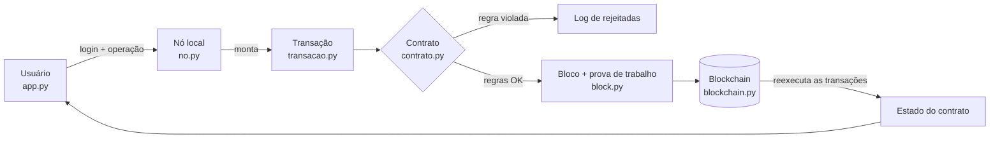

# CertChain UEA

Projeto do 1º bimestre de Oficina de Desenvolvimento de Sistemas III (UEA). Registramos diplomas em uma blockchain local, e um contrato inteligente define quem pode emitir e revogar. Qualquer pessoa confere se um diploma é verdadeiro.

## Problema

Hoje o diploma circula como PDF, e qualquer editor de PDF troca o curso ou a carga horária em poucos minutos. Para conferir, a empresa precisa falar com a secretaria da universidade, o que só anda em horário comercial. E o sistema da secretaria é central: quem tem acesso de administrador consegue mudar um registro sem que ninguém perceba.

## Como o CertChain resolve

A secretaria preenche os dados do aluno e o sistema gera o PDF do diploma. O hash SHA-256 desse arquivo vai para a blockchain numa transação enviada pela conta da secretaria.

Quem recebe o diploma abre a tela de verificação e envia o PDF. Se o hash estiver registrado e ativo, o diploma é autêntico. Basta mudar um byte do arquivo para o hash mudar e o sistema deixar de reconhecê-lo.

A Reitoria decide quais secretarias podem emitir. Se um diploma sair com erro, a secretaria revoga, e o histórico guarda a emissão e a revogação.

## Por que blockchain

Num banco de dados comum, o administrador edita um registro e ninguém fica sabendo. Na blockchain, cada bloco carrega o hash do bloco anterior. Se alguém edita um registro antigo, a validação da cadeia aponta o bloco adulterado. Cada transação também registra quem a enviou, então dá para saber quem emitiu cada diploma. As regras ficam no contrato, que as aplica do mesmo jeito para todo mundo, e na cadeia só entram hashes, o que permite verificar sem expor dados pessoais.

## Arquitetura



| Arquivo | Função |
|---|---|
| `block.py`, `blockchain.py` | Blocos, prova de trabalho, validação da cadeia e gravação em disco. A base veio do exemplo que o professor passou em aula |
| `contas.py` | Contas de usuário. A senha é guardada como hash SHA-256, nunca em texto |
| `transacao.py` | Monta a transação: tipo, remetente, horário e dados |
| `contrato.py` | Contrato inteligente com as regras de negócio |
| `no.py` | Nó local: login, cadastro de alunos, envio das transações ao contrato e mineração |
| `diploma.py` | Gera o PDF do diploma |
| `app.py` | Interface em Streamlit |
| `tests/` | Testes com pytest |

O nó não guarda o estado do contrato em outro arquivo. Ao iniciar, ele reexecuta todas as transações desde o bloco gênesis, então a blockchain é a única fonte dos dados.

## Contrato inteligente

A Reitoria é o administrador, definido no bloco gênesis. Ela autoriza e remove emissores, mas não emite diplomas. As secretarias EST e ESA também constam no gênesis como emissoras, e cada uma só revoga o que emitiu. Alunos entram para consultar e baixar os próprios diplomas; se tentarem emitir, o contrato rejeita. A verificação é pública e não exige login.

O contrato confere todas as regras antes de alterar qualquer dado. Se uma falha, a transação vai para o log de rejeitadas e nenhum bloco é criado.

| Regra | Operação | O que o contrato exige |
|---|---|---|
| G1 e G2 | todas | campos completos e operação conhecida |
| A1 a A5 | autorizar emissor | só o admin; usuário informado; nome com 3 a 100 caracteres; o admin não pode ser emissor; o emissor ainda não pode estar ativo |
| R1 e R2 | remover emissor | só o admin, e o emissor precisa estar ativo |
| E1 a E9 | emitir diploma | emissor ativo; código no formato `A-Z0-9-` e inédito; hash do PDF válido e inédito; hash do titular válido; curso com 3 a 120 caracteres; carga horária de 1 a 20000; data de conclusão que não esteja no futuro |
| V1 a V4 | revogar diploma | o diploma existe e está ativo; quem revoga é o emissor original ou o admin; motivo com 5 a 200 caracteres |
| N1 | nó | a cadeia precisa estar íntegra para o nó aceitar transações |

## O que fica na blockchain

Na cadeia ficam o hash do PDF, o hash do titular (matrícula + nome), o código, o curso, a carga horária, a data de conclusão, a instituição que emitiu, o status do diploma e, em cada transação, quem enviou e o horário.

Ficam de fora o PDF, o nome, a matrícula e o CPF do aluno, as senhas e o log de rejeitadas. Quem tem o PDF, ou o nome e a matrícula, consegue conferir o diploma. Quem olha só a cadeia vê hashes.

## Como executar

É preciso ter Python 3.10 ou mais recente.

```bash
pip install -r requirements.txt
streamlit run app.py      # abre em http://localhost:8501
python -m pytest -v       # testes
```

Na primeira execução, o app cria a pasta `dados/` com a blockchain e as contas de demonstração. A tela de login lista essas contas e as senhas. Para começar do zero, apague `dados/`.
